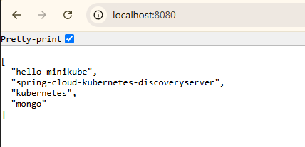

# SPRING-K8S-SERVICE-DISCOVERY

### Short Tutorial
First, you need to pull the **spring discovery server**, which has to run in your k8s cluster.
`kubectl apply -f .\k8s\spring-discovery-server.yaml`

In order to communicate with your **spring discovery server**, add the following dependencies to your projec/client:

```
<dependency>
    <groupId>org.springframework.cloud</groupId>
    <artifactId>spring-cloud-starter-kubernetes-discoveryclient</artifactId>
    <version>3.2.0</version>
</dependency>
```

*hint: The **spring discovery server** version specified in your `.\k8s\spring-discovery-server.yaml` has to match the client version `<version>3.2.0</version>` in your maven file.*

Now, specify the uri to the discovery server in your application.properties.
```
spring.cloud.kubernetes.discovery.discovery-server-url=http://spring-cloud-kubernetes-discoveryserver
```


### Deploy to Minikube

build the project
```
maven clean
maven install 
```

create a docker image

```
docker build -t discovery -f Dockerfile .   
```

load the docker image into minikube
```
minikube image load discovery  
```

create a pod in your minikube cluster
```
kubectl run discovery --image=discovery --image-pull-policy=Never --restart=Never
```

create a port forward  
```
kubectl port-forward discovery 8080
```
check your browser



